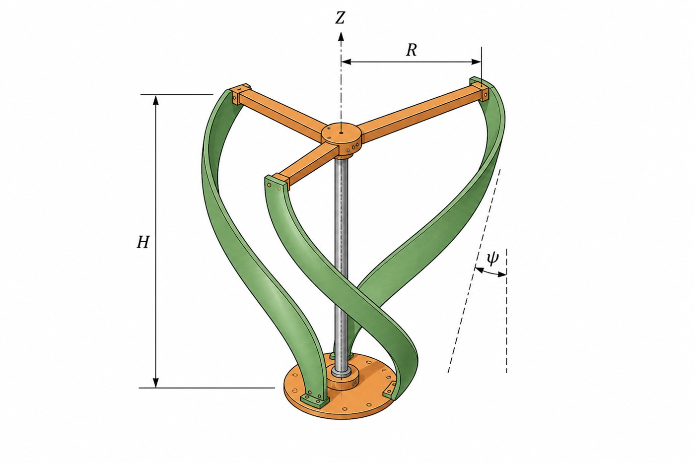
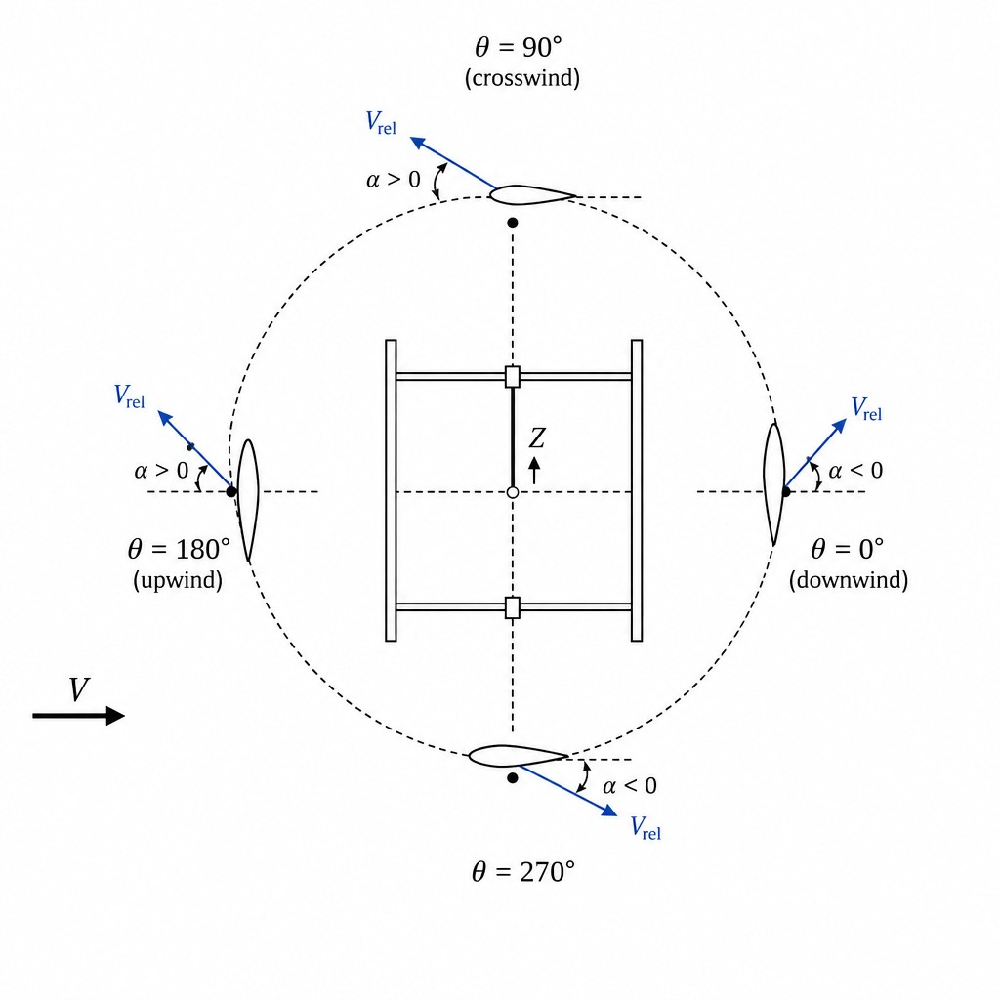
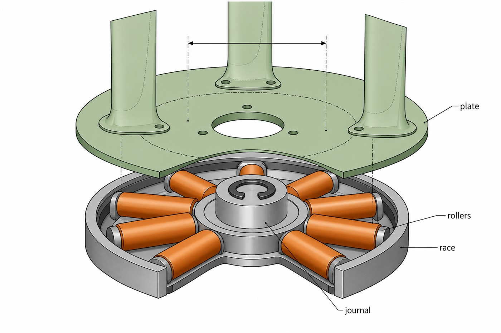
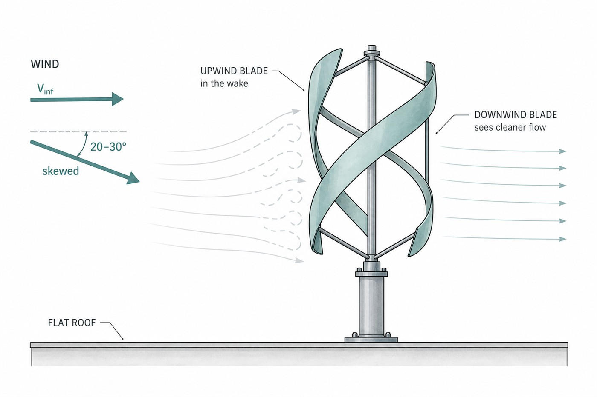

# Print-kit aero — research contract

Which files are live: [PRINT_KIT_FILES.md](PRINT_KIT_FILES.md).
Source numbers: `scripts/fixtures/print-kit-tutor.spec.json`.
Figures: [figures/print-kit-aero/](figures/print-kit-aero/)
(rebuild with `node scripts/print-kit-aero-figures.mjs`).
Appearance (organic root / tip landing) is **not** aero:
[PRINT_KIT_ORGANIC_REFERENCE.md](PRINT_KIT_ORGANIC_REFERENCE.md).

This is **not** “the ideal airfoil for windmills.” It is the best
**coupled symmetric section in the published low-TSR Darrieus design
space** for a printed, directionless, low/medium-speed machine. A HAWT
or a high-TSR Darrieus would pick a different foil.

**Fig. 9.** Live architecture: three identical helical blades on a thin
root plate, axis \(Z\). No yaw. Radius \(R\), span \(H\), helix \(\psi\).

---

## 1. Operating point

| Quantity | Kit intent | Why |
|----------|------------|-----|
| Architecture | Helical H-Darrieus, \(N=3\), axis \(Z\) | No yaw. Wind from any azimuth. |
| Tip-speed ratio \(\lambda\) | \(\sim 2.0\)–\(3.0\) | Urban / rooftop / desk-scale Re. High \(\lambda\) needs a thinner foil. |
| Reynolds (exam \(0.4\)) | \(c\sim 30\,\mathrm{mm}\), \(V\sim 3\)–\(8\,\mathrm{m/s}\) | \(\mathrm{Re}_c\sim 10^4\)–\(4\cdot 10^4\). Thick section + high solidity, or it will not start. |
| Reynolds (scale \(1.0\)) | \(c=74\,\mathrm{mm}\) | Still low-Re. Same section family. |
| Solidity \(\sigma_\mathrm{kit}\) | \(0.380\) | Low-TSR torque and self-start. Cap \(0.45\) so it does not choke at medium \(\lambda\). |
| Helix | \(\psi=60^\circ\) from a \(30^\circ\) root | Best mean \(C_P\) among \(60/90/120\) in 3D CFD; still covers the rev. |

A Darrieus blade sees **reversing \(\alpha\) every revolution**. Camber
that helps the upwind pass hurts the downwind pass. That is why the
section is symmetric (NACA 00xx), not a HAWT camber.

**Fig. 12.** Same symmetric section at four azimuths. \(V_\infty\) is
fixed; \(V_\mathrm{rel}\) and \(\alpha\) reverse sign from the upwind
half to the downwind half. (Quantitative \(\alpha(\theta)\) is Fig. 3.)

---

## 2. Kinematics and coefficients

### 2.1 Tip-speed ratio

\[
\lambda \;=\; \frac{\omega R}{V_\infty}
\]

\(\omega\) is shaft speed [rad/s], \(R\) is the mid-chord radius.
The live source is \(R=85\,\mathrm{mm}\) (exam \(34\,\mathrm{mm}\)).

### 2.2 Geometric angle of attack (no induction)

For a straight H-rotor blade with mid-chord on the cylinder and chord
tangent ([Paraschivoiu](#ref-paraschivoiu), [Rezaeiha 2018](#ref-rezaeiha-2018)):

\[
\alpha(\theta)
\;=\;
\operatorname{atan2}\!\bigl(\sin\theta,\;\lambda+\cos\theta\bigr)
\]

\(\theta=0\) is downwind. At low \(\lambda\) the blade walks through
\(\lvert\alpha\rvert\gtrsim 20^\circ\) every revolution — **dynamic
stall**, not a polar at one \(\alpha\).

**Fig. 3.** \(\alpha(\theta)\) at the four \(\lambda\) that bound the
kit. The live foil is sized for the **green** curve (\(\lambda=2.5\)),
not the grey high-\(\lambda\) curve.

### 2.3 Relative speed and chord Reynolds

\[
\frac{\lvert\mathbf{V}_\mathrm{rel}\rvert}{V_\infty}
\;=\;
\sqrt{1+2\lambda\cos\theta+\lambda^2}
\]

\[
\mathrm{Re}_c(\theta)
\;=\;
\frac{\lvert\mathbf{V}_\mathrm{rel}\rvert\,c}{\nu}
\qquad
\nu_\mathrm{air}\approx 1.5\cdot 10^{-5}\,\mathrm{m}^2/\mathrm{s}
\]

**Fig. 4.** \(\lvert V_\mathrm{rel}\rvert/V_\infty\). Exam-scale example:
\(c=29.6\,\mathrm{mm}\), \(V_\infty=5\,\mathrm{m/s}\), \(\lambda=2.5\)
gives \(\lvert V_\mathrm{rel}\rvert\sim 7.5\)–\(17.5\,\mathrm{m/s}\) and
\(\mathrm{Re}_c\sim 1.5\cdot 10^4\)–\(3.5\cdot 10^4\).

### 2.4 Power and thrust

Swept area of an H-rotor is the rectangle \(A=2RH\), not a disk.

\[
C_P
\;=\;
\frac{P}{\tfrac12\rho A V_\infty^3}
\qquad
C_T
\;=\;
\frac{T}{\tfrac12\rho A V_\infty^2}
\qquad
C_m
\;=\;
\frac{M}{\tfrac12\rho A R V_\infty^2}
\]

Identity: \(C_P=\lambda\,C_m\). Betz’s limit \(C_P\le 16/27\) is a
**HAWT actuator-disk** bound; a low-Re printed VAWT will not approach
it. The papers below report \(\Delta C_P\) **inside** a 126-foil family,
not against Betz.

### 2.5 Solidity (two numbers, one kit)

The compilers use the **tip-sweep** diameter, not \(2R\):

\[
R_\mathrm{tip}
\;=\;
R + 0.15\,c_\mathrm{tip}
\qquad
D
\;=\;
2R_\mathrm{tip}
\qquad
\sigma_\mathrm{kit}
\;=\;
\frac{N\,c_\mathrm{root}}{\pi D}
\]

Scale \(1.0\): \(R=85\), \(c_\mathrm{root}=74\), \(c_\mathrm{tip}=54\)
\(\Rightarrow R_\mathrm{tip}=93.1\), \(D=186.2\),
\(\sigma_\mathrm{kit}=0.3795\).

The textbook H-rotor solidity on the mid-chord cylinder is larger:

\[
\sigma_\mathrm{cyl}
\;=\;
\frac{N\,c_\mathrm{root}}{\pi\cdot 2R}
\;=\;
0.4157
\]

The exam report prints \(\sigma=0.380\) because it calls
`solidity()` = \(\sigma_\mathrm{kit}\). The allowed band in the grader
is \(0.24\le\sigma\le 0.45\) ([Rezaeiha 2018](#ref-rezaeiha-2018)
high-\(\sigma\) start vs low-\(\sigma\) peak-\(C_P\) trade).

**Fig. 6.** Mid-chord on the cylinder, chord tangent. A hoop-sector
“scoop” would face the axis and make no torque. Dashed circle is
\(R_\mathrm{tip}\).

---

## 3. The live section — NACA 0024-4.5/3.5

| Symbol | Value | Meaning |
|--------|-------|---------|
| \(0024\) | \(t/c=0.24\) | Maximum thickness |
| \(4.5\) | LE index \(I\) | Sharper nose than the default \(I=6\) |
| \(3.5\) | \(x_t/c=0.35\) | Max thickness at 35% chord (aft of the stock 30%) |

**Fig. 1.** Same modified-4-digit ordinates the compilers loft.
Green = live. Gold = organic-reference **0021**. Grey = Tirandaz
baseline **0018-6.0/3.0**.

### 3.1 Ordinates (Ladson / NASA TM 4741)

The kit does **not** use the stock 4-digit polynomial
([NACA R-460](#ref-naca-460)). It uses the **modified 4-digit**
family ([NASA TM 4741](#ref-tm4741); same split Tirandaz writes as
their Eq. (1)). Thickness is defined on a 20% model and scaled by
\(t/0.20\).

Let \(p=x_t/c\in[0.22,0.42]\) and \(I\in[3,9]\). Coefficients in
`naca4_modified_yt_over_c` / `naca4ModifiedYtOverC`:

\[
a_0 = 0.2969\cdot\frac{I}{6},
\qquad
d_0=0.002,
\qquad
d_1=0.234,
\qquad
u=1-p
\]

Aft cubic (\(x>p\)), then \(C^2\) match at \(x=p\), then the fore cubic
(\(x\le p\)):

\[
\frac{y_{20}}{c}(x)
\;=\;
\begin{cases}
a_0\sqrt{x}+a_1 x+a_2 x^2+a_3 x^3, & 0\le x\le p \\[4pt]
d_0+d_1(1-x)+d_2(1-x)^2+d_3(1-x)^3, & p<x\le 1
\end{cases}
\]

\[
\frac{y_t}{c}(x)
\;=\;
\frac{t}{0.20}\,\frac{y_{20}}{c}(x)
\]

Stations are cosine-clustered (more points at the nose):

\[
x_k
\;=\;
\tfrac12\bigl(1-\cos(\pi k/(n-1))\bigr),
\qquad k=0\ldots n-1
\]

Closed loop: upper then reversed lower. Print floor: last quarter-chord
\(\ge 2\) nozzles; last point exactly \(t_{E,\min}/2\) so the solid
stays a 2-manifold.

**Fig. 2.** Live \(y_t/c\). At \(x_t/c=0.35\),
\(y_t/c=0.1200\) so \(t/c=0.2400\) exactly.

Leading-edge radius of the modified family
([TM 4741](#ref-tm4741), [Abbott & von Doenhoff](#ref-abbott)):

\[
\frac{r_\mathrm{LE}}{c}
\;=\;
1.1019\left(\frac{I}{6}\,t\right)^2
\]

Live: \(I=4.5\), \(t=0.24\) \(\Rightarrow r_\mathrm{LE}/c=0.0357\).
Stock \(I=6\) at the same \(t\) would be \(0.0635\) — a blunter nose
that Tirandaz finds **worse** \(C_P\) at low \(\lambda\).

### 3.2 Source of the match (same 126-foil family)

The three shape parameters \((t/c,\,x_t/c,\,I)\) are **coupled**.
Changing one while holding the others is the mistake the papers exist
to stop.

1. **[Tirandaz & Rezaeiha 2021](#ref-tirandaz-2021)** —
   *Renewable Energy* **173** 422–441.
   doi:[10.1016/j.renene.2021.03.142](https://doi.org/10.1016/j.renene.2021.03.142).
   252 URANS, 126 symmetric modified-NACA foils, transition SST,
   validated on three experiments. When \(\lambda\) drops from \(3.0\)
   to \(2.5\), the optimum moves from **NACA 0018-4.5/2.75** to
   **NACA 0024-4.5/3.5**: thicker, \(x_t\) aft to \(35\%c\), \(I\)
   stays \(4.5\). Reducing \(I\) from \(6.0\) to \(4.5\) raises \(C_P\).

2. **[Tirandaz, Rezaeiha & Micallef 2023](#ref-tirandaz-2023)** —
   *Wind Energy Science* **8** 1403–1424.
   doi:[10.5194/wes-8-1403-2023](https://doi.org/10.5194/wes-8-1403-2023).
   630 transient runs. As \(\lambda\) **rises**, the optimum **thins**
   (\(24\%\to 10\%\)) and \(x_t\) moves forward. \(I\) stays \(4.5\)
   until \(\lambda=5.5\). This kit is the **low-\(\lambda\) end**.

3. **[Tirandaz, Rezaeiha & Micallef 2026](#ref-tirandaz-2026)** —
   *Energies* **19**(7) 1615.
   doi:[10.3390/en19071615](https://doi.org/10.3390/en19071615).
   Thick + aft \(x_t\) + lower \(I\) shifts stall from an abrupt
   leading-edge burst to a slower trailing-edge process, weakens the
   dynamic-stall vortex, and cuts unsteady load. Best case in that
   space: **NACA 0024-4.5/3.5**, **\(+73\%\,C_P\)** vs
   NACA 0018-6.0/3.0.

**Fig. 7.** Published optimum vs \(\lambda\) from the 2023 *WES* map.
A thinner foil is “better” only if the machine actually runs at that
\(\lambda\). Ours does not.

**What we did not pick, and why**

| Alternative | Why not for this kit |
|-------------|----------------------|
| Stock NACA 0021 (\(I=6\), \(x_t=30\%\)) | Default helicopter foil. Loses the coupled \(I/x_t\) gain at low \(\lambda\). Frozen as the **appearance** snapshot only. |
| NACA 0018-4.5/2.75 | Optimum at \(\lambda\approx 3.0\), not \(2.5\). Thinner = worse start at this Re. |
| NACA 4412 / cambered HAWT | One-way camber. Directionless VAWT sees \(-\alpha\) every half-rev. |
| Gurney / hybrid flap on 0021 | Can raise low-Re \(C_P\) ([*Results in Engineering* 2026](#ref-gurney)). Extra print, extra fatigue, not a substitute for the section. |
| Whale tubercles | Mixed 2023–2025 VAWT results; \(0.4\,\mathrm{mm}\) nozzle cannot hold \(0.06c\) amplitude at exam chord. |
| Savonius-only | Directionless **drag** machine. Low \(C_P\). Optional starter, not the wing ([Gu / MacDonald / Tang 2026](#ref-savonius)). |

---

## 4. Other geometry (capability)

| Decision | Mathematics / research |
|----------|------------------------|
| \(N=3\) at \(120^\circ\) | Odd count, even torque, no preferred azimuth. |
| \(c=74/54\) (exam \(29.6/21.6\)) | Longer chord raises \(\mathrm{Re}_c\) and \(\sigma\). Draft \(c_\mathrm{root}>c_\mathrm{tip}\) for a standing print. |
| \(\psi=60^\circ\) from \(30^\circ\) root | [Divakaran et al. 2021](#ref-divakaran-2021): among \(60/90/120^\circ\), **\(60^\circ\) had the best mean \(C_P\)**. Larger helix is smoother (lower \(\mathrm{std}(C_m)\)) but peaks later. |
| Even-machine golden | \(\theta_\mathrm{root}+\psi/2=30+30=60\). Grader: `wing_offset_deg + helix_deg * 0.5 == 60`. Do not change helix without updating that. |
| Mid-chord on the cylinder | H-Darrieus definition. Chord stays tangent. |
| Open tips, short taper | Print sit + less tip vortex than a square cut. Not an endplate. |

**Fig. 5.** Span vs azimuth. At any instant some station is at a
working \(\alpha\). A straight H-rotor has dead azimuths and a once-per-rev
slam on PLA.

Helix pitch along span \(\eta\in[0,1]\):

\[
\theta(\eta)
\;=\;
\theta_\mathrm{root}+\psi\,\eta
\]

Four loft stations (spec `helix_stations: 4`): organic root, two helix
stations, tapered flat landing.

---

## 5. Durability (loads, not just \(C_P\))

Capability without a bearing is a spinner that dies.

**Fig. 11.** Thin flat thrust under the blade roots. Eight radial-axis
rollers. Pack height = roller \(\varnothing\). Inner/outer keepers.
Constant journal + C-clip. Not a tall drum and not an inboard cracker.

| Load | What takes it | Why this way |
|------|---------------|--------------|
| Torque about \(Z\) | One-piece rotor + 8 radial rollers | Helix cuts torque ripple ([Battisti](#ref-battisti), [Marsh](#ref-marsh), [Divakaran](#ref-divakaran-2021)). Less cyclic load on PLA. |
| Thrust / weight | Flat pack, height = roller \(\varnothing\) | Not a tall drum. Not a cone. |
| Overturning from the tips | Same pack, PCD **under the roots** | Couple \(M\sim F_\mathrm{tip}H\) across diameter \(\approx 2R\). An inboard pack leaves the plate as a cracker. |
| Reversing \(\alpha\) / DS | Thick aft 0024-4.5/3.5 | The 2026 *Energies* result is also a **load** result: weaker DSV, less unsteady bending. |
| Root print cliff | Organic \(1.28\times\) blend | Stress riser, not aero. |
| Radial escape | Inner/outer keeper walls | Survive the top-load cut. |
| FDM skin | PLA demo. Sand \(400\to 1000\) | As-printed \(R_a\sim 10\)–\(25\,\mu\mathrm{m}\) is \(C_d\). Vapor-smooth would eat the modeled running fit. |

Second-moment scaling of a thick section (order-of-magnitude):

\[
I_{xx}\propto t^3 c
\quad\Rightarrow\quad
\frac{I_{0024}}{I_{0018}}
\;\approx\;
\left(\frac{0.24}{0.18}\right)^3
\;=\;
2.37
\]

PLA-on-PLA is a demo spin. A later metal 608 table is in
[ASSEMBLY.md](ASSEMBLY.md). The **architecture** (wide flat pack under
the roots, helix, thick section) is what you keep when the material
upgrades.

Exam pack (scale \(0.4\)): \(8\times\varnothing 8.0\times L11.2\) on
PCD \(59.1\); race \(\varnothing 76.7\) / ID \(44.7\); plate
\(\varnothing 78.7\times h4.0\); journal \(\varnothing 12.0\times h16.2\).

---

## 6. Wind from every direction — including oblique

**Horizontal azimuth (any compass heading): already designed for this.**
A VAWT does not yaw. Three identical symmetric helical blades at
\(120^\circ\) produce the same family of torque from any incoming
heading. A HAWT section or a one-sided vane would break that.

**Oblique / skewed wind (not horizontal — rooftop, canyon, tilt):**
already usable, and sometimes **better** than pure crossflow.

**Fig. 10.** Skewed inflow. The downwind blade is less buried in the
upwind wake; 3D URANS of H-VAWTs report a \(C_P\) **gain** on that
pass ([Mertens](#ref-mertens), [Orlandi et al. 2015](#ref-orlandi-2015)).

Let \(\gamma\) be the angle between \(\mathbf{V}_\infty\) and the
horizontal. The in-plane component that the H-rotor sees is
\(V_\infty\cos\gamma\); the spanwise component is \(V_\infty\sin\gamma\).
Orlandi’s result is that the 3-D relief of the downwind wake can
outweigh the \(\cos^3\gamma\) power drop over a useful rooftop range
of \(\gamma\).

The **\(60^\circ\) helix** is what turns shifting and skewed urban wind
into shaft motion instead of a once-per-rev slam: at any instant some
span station is at a working \(\alpha\).

**What we would not add for “more directions”**

| Change | Why not now |
|--------|-------------|
| Yaw bearing / tail | HAWT habit. This machine must not care. |
| Camber or a one-way flap | Breaks reverse-\(\alpha\). |
| \(90\)–\(120^\circ\) helix | Smoother, but [Divakaran 2021](#ref-divakaran-2021): worse mean \(C_P\) than \(60^\circ\). |
| Inner Savonius / hybrid | Real low-\(\lambda\) starter. Extra body, extra drag at medium \(\lambda\). Optional later, not the wing. |
| Sphere / \(\Phi\)-rotor | Better some 3-D inflow. Not a flat-print + standing-plate kit. |

So: **right now it takes wind from any heading and from moderate
oblique tilt**, and it turns that into rotation about \(Z\) through the
printed thrust pack. The next capability step is not a new foil. It is
a hybrid starter or a material upgrade on the same pack.

---

## 7. Live numbers (scale \(1.0\) / exam \(0.4\))

From `numbers.json`, generated by the same script as the figures.

| | Scale \(1.0\) | Exam \(0.4\) |
|--|--------------:|-------------:|
| Section | NACA 0024-4.5/3.5 | same |
| \(t/c\), \(x_t/c\), \(I\) | \(0.24\), \(0.35\), \(4.5\) | same |
| \(y_t/c\) at \(x_t\) | \(0.1200\) | same |
| \(r_\mathrm{LE}/c\) | \(0.0357\) | same |
| \(R\) [mm] | \(85\) | \(34.0\) |
| Span \(H\) [mm] | \(236\) | \(94.4\) |
| \(c_\mathrm{root}/c_\mathrm{tip}\) [mm] | \(74/54\) | \(29.6/21.6\) |
| \(\sigma_\mathrm{kit}\) | \(0.380\) | \(0.380\) |
| Helix / root azimuth | \(60^\circ\) / \(30^\circ\) | same |
| Rollers | \(8\times\) \(L28\) | \(8\times\varnothing 8.0\times L11.2\) on PCD \(59.1\) |
| Plastic | — | \(90.5\,\mathrm{cm}^3\) / \(47.2\,\mathrm{g}\) / \(\$0.94\) |
| Bodies / joints | — | \(11\) / \(10\) |

---

## 8. References

Ladson, C. L., Brooks, C. W. Jr., Hill, A. S. & Sproles, D. W. (1996).
*Computer program to obtain ordinates for NACA airfoils.*
NASA TM 4741.
<https://ntrs.nasa.gov/citations/19970008124>

Jacobs, E. N., Ward, K. E. & Pinkerton, R. M. (1933).
*The characteristics of 78 related airfoil sections from tests in the
variable-density wind tunnel.* NACA Report 460.

Abbott, I. H. & von Doenhoff, A. E. (1959).
*Theory of Wing Sections.* Dover.

Paraschivoiu, I. (2002).
*Wind Turbine Design: With Emphasis on Darrieus Concept.*
Polytechnic International Press.

Rezaeiha, A., Montazeri, H. & Blocken, B. (2018).
Towards optimal aerodynamic design of vertical axis wind turbines:
impact of solidity and number of blades.
*Energy* **165** 1129–1148.
doi:[10.1016/j.energy.2018.09.192](https://doi.org/10.1016/j.energy.2018.09.192)

Tirandaz, M. R. & Rezaeiha, A. (2021).
Effect of airfoil shape on power performance of vertical axis wind
turbines in dynamic stall: Symmetric Airfoils.
*Renewable Energy* **173** 422–441.
doi:[10.1016/j.renene.2021.03.142](https://doi.org/10.1016/j.renene.2021.03.142)

Tirandaz, M. R., Rezaeiha, A. & Micallef, D. (2023).
Towards smart blades for vertical axis wind turbines: different
airfoil shapes and tip speed ratios.
*Wind Energy Science* **8** 1403–1424.
doi:[10.5194/wes-8-1403-2023](https://doi.org/10.5194/wes-8-1403-2023)

Tirandaz, M. R., Rezaeiha, A. & Micallef, D. (2026).
A deeper insight into dynamic stall of vertical axis wind turbines:
parametric study of symmetric airfoils.
*Energies* **19**(7) 1615.
doi:[10.3390/en19071615](https://doi.org/10.3390/en19071615)

Divakaran, U., Ramesh, A., Mohammad, A. & Velamati, R. K. (2021).
Effect of helix angle on the performance of helical vertical axis
wind turbine.
*Energies* **14**(2) 393.
doi:[10.3390/en14020393](https://doi.org/10.3390/en14020393)

Orlandi, A., Collu, M., Zanforlin, S. & Shires, A. (2015).
3D URANS analysis of a vertical axis wind turbine in skewed flows.
*J. Wind Eng. Ind. Aerodyn.* **147** 77–84.
[Strathprints copy](https://strathprints.strath.ac.uk/71845/1/Orlandi_etal_JWEIA_2015_3D_URANS_analysis_of_a_vertical_axis_wind_turbine_in_skewed_flows.pdf)

Mertens, S., van Kuik, G. & van Bussel, G. (2003).
Performance of an H-Darrieus in the skewed flow on a roof.
*J. Sol. Energy Eng.* **125**(4) 433–440.

Battisti, L., et al. (2018).
Experimental benchmark data for H-shaped and troposkien VAWT
architectures.
*Renewable Energy* **125** 425–444.

Marsh, P., Ranmuthugala, D., Penesis, I. & Thomas, G. (2015).
Numerical investigation of the influence of blade helicity on the
performance characteristics of a vertical axis marine turbine.
*Renewable Energy* **81** 840–847.

Results in Engineering (2026). Hybrid Gurney / flap studies on thick
symmetric VAWT sections at low Re — cited as a **rejected substitute**
for changing the section.

Gu, MacDonald & Tang (2026).
Savonius as a directionless drag starter, not a lift wing.
*Flow* **6**.
