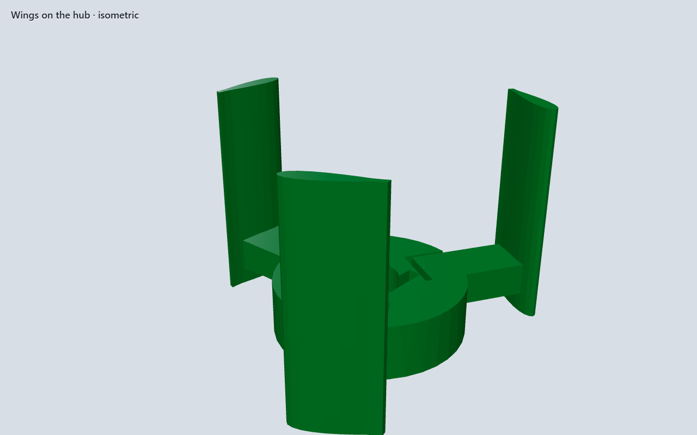
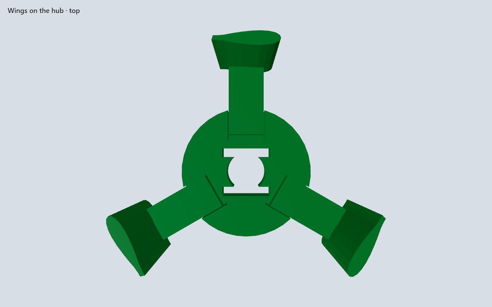
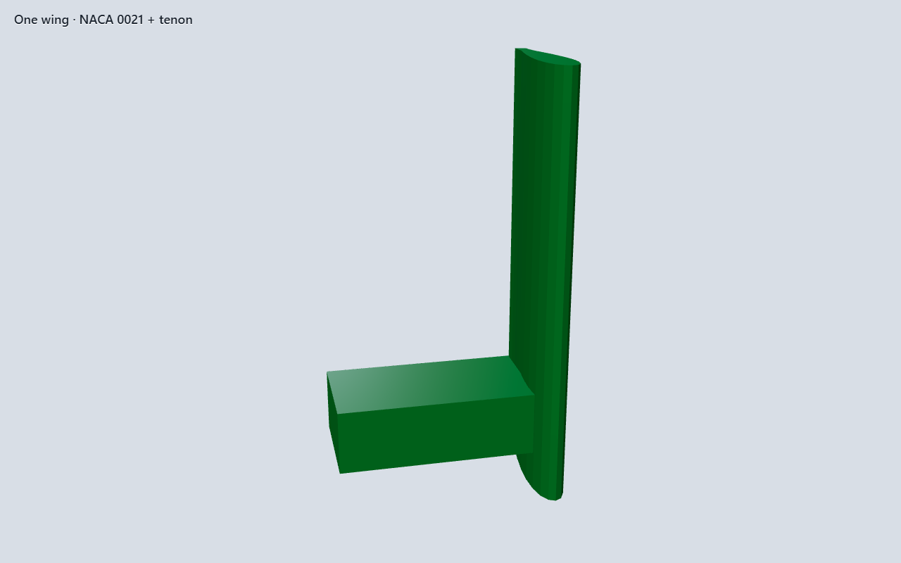

# Print-kit tutor — GD&T and printability study

Pro-forma study for benchmark #1 (`fdm-print-vawt`). The first assembled
spinner looked like a kit and was not one. The next kit was a leftover
helical loft inside a good frame. Replacing that with a turntable threw
the frame away — and left the wing with nothing to use. This page is the
correction record. Numbers live in `scripts/fixtures/print-kit-tutor.spec.json`.

## Product fault (why the turntable was wrong)

The Ø90 post-and-plate stack is a **two-bearing stand**: cup in the base,
sleeve in the top plate, posts locating the upper bearing. That is how a
small VAWT is built. The wing uses that stand by mounting to a hub on the
shaft and sweeping the bays between the posts.

A lazy-Susan platter with paint wells does not use the frame. Helical
C-buckets joined to a hub also failed: they were leftover loft, not a
mount. A concentric ring sector is also not a wing: the concave face
points at the axis and cannot catch wind. The wing is a **vertical
blade** (chord tangential, span up the bay) with a tenon into a hub
socket. Windows in the top plate keep the blades visible.

## Faults found (and closed)

| Fault | Why it failed | Correction |
|-------|---------------|------------|
| Product (turntable) | Competent bearings, no wing. The frame had nothing to do. | **Printed VAWT.** Keep the two-bearing frame. Hub sockets. Three wings that drop on. |
| Product (leftover loft) | Two helical C-buckets joined to a hub. Not a mount, not assemblable as a wing. | Separate wing bodies. Tenon in socket. No loft. |
| Product (hoop sector) | “Scoop” was an 80° annulus at r20–r28. Concave faces the axis. Looks like a broken rim. Cannot make torque. | Named symmetric airfoil, chord tangential. |
| Product (flat plate) | 12 × 2.4 × 32 rectangle. A vane, not a section. Directionless VAWT sees reversing α. | **NACA 0021** (t/c 0.21), blunt TE ≥ 0.8 mm. 2026 band is t/c 21–24%. |
| Rotor vs posts | C-buckets sweep ~Ø56. Posts on R24 × Ø6 occupy R21–27. They collide. | Posts on **R38 × Ø8**. Inner wall R34. Blade tip ~**R25**. ≥9 mm air. Wings in the bays (60° offset). |
| Posts vs plate | Posts stopped at the plate bottom. Holes did not locate. | Posts continue **through** the 6 mm plate and stand **2 mm proud**. |
| Bushing seat | Plate and seat were both 4 mm. Seat was a through-hole. Bushing falls. | Plate **6 mm**. Seat **4 mm** from the top. **2 mm land** under the sleeve. |
| Cone “seat” | Same 45° + tip lift = parallel cones. No contact. Shaft falls. | Female 45° r5. Male r**4.8** (0.20 radial). Thrust on a **Ø13 × 0.8 land** with **0.20 float**. |
| Rotor drive | Round-on-round slip. Rotor need not turn the shaft. | **Double-D** 6.0 / 6.4 in the hub zone only. |
| Wing mount | No interface. Blade was a leftover solid. | Hub **sockets** 8 × 6 × 5. Wing **tenon** 7.6 × 4.8 (+0.40 / 0.20 float). |
| Hub vs shoulder | Hub started at the shoulder plane with an Ø8.4 bore around the Ø16 shoulder. They occupy the same volume. | Hub **sits on the shoulder top**. `plate_z` includes the 2 mm shoulder. |
| Twisted buckets | Radial C-walls ortho-snapped. Loft stations had no closed profile. | No loft. Vertical plates. Socket/tenon lines drawn with **ctrl held**. |

## Datum scheme

| Datum | Feature | Role |
|-------|---------|------|
| **A** | Base bottom | Primary. Frame print bed. |
| **B** | Journal / cone axis | Secondary. Turbine axis. |
| **C** | 3× Ø8 posts, Ø76 PCD, 120° | Tertiary. Top-plate location. Wings sit in the bays. |

Position of C to B: **Ø0.4 MMC** (one 0.4 mm nozzle). Tighter than that is a
gauge-print problem, not a CAD problem.

## Fits (modeled in CAD, slicer XY hole comp = 0)

| Joint | Class | CAD |
|-------|-------|-----|
| Journal ↔ bushing | Running | Ø8.0 / Ø8.4 (+0.40 diametral) |
| Posts ↔ plate | Location slip | Ø8.0 / Ø8.4, through |
| Bushing ↔ seat | Location slip | Ø14.0 / Ø14.4 + 2 mm land |
| Double-D drive | Location slip | 6.0 / 6.4 across flats |
| Wing tenon ↔ hub socket | Location slip | 7.6 / 8.0 width; 0.20 axial float |
| Cone center | Clearance | 0.20 radial at the mouth |
| Thrust land, cap | Axial play | 0.20 float — **no coincident running faces** |

Shoulder ↔ hub bottom is a **sitting** face (they rotate together). That
contact is intentional.

## Printability (0.4 mm Bambu, 0.20 mm layer)

| Body | Print orientation | Notes |
|------|-------------------|-------|
| Base | As assembled (A on the bed) | 45° cup needs no support. Posts print up. |
| Shaft | Land / shoulder on the bed | Do not print on the cone tip. Double-D flats are vertical walls. |
| Hub | Face on the bed | Sockets are complete XY pockets. |
| Wing | Standing, layer lines spanwise | NACA 0021. Blunt TE ≥ 0.8 mm. Sand skins. |
| Top plate | Flat | All functional holes are complete XY circles. |
| Bushing | Ring on the bed | Bore is an XY circle. |
| Cap | Flat | Same. |

Minimum wall 1.6 mm. No horizontal holes. No FDM press fits. Break 0.4×45
on post tips in the slicer if they hang on the plate.

## Assembly (proper)

1. Shaft cone into the cup — land floats 0.20 above A.
2. Hub double-D onto the journal; hub **sits on** the shoulder.
3. Each wing **drops** its tenon into a hub socket. The blade stands in a post bay.
4. Top plate down the three posts (holes actually engage).
5. Sleeve into the shouldered seat.
6. Cap onto the round journal, 0.20 above the plate.

If those steps are not visible in the solid, the exam failed.

## Wings (hub off the lid)

The top plate used to hide the rotor. These views are hub + three wings
only. The section is **NACA 0021**, not a hoop and not a flat plate.

## Assembled park

## As-built stack (spec)

| Body | z min–max | Notes |
|------|-----------|--------|
| Base + posts | 0–60 | Posts through the 52–58 plate, 2 mm proud |
| Shaft | 1.5–62 | Land above the cup; journal through the cap |
| Hub | 18–26 | Sits on the shoulder; sockets from the top |
| Wings | 18–50 | Vertical blades; tenon in the socket; 2 mm air to the plate |
| Top plate | 52–58 | Ø90 × 6 with Ø16 windows over the blades |
| Bushing | 54–58 | On the 2 mm land |
| Cap | 58.2–60.6 | 0.20 float |

Blade tip ~R25 < post inner R34. Nine coaxial bodies.
