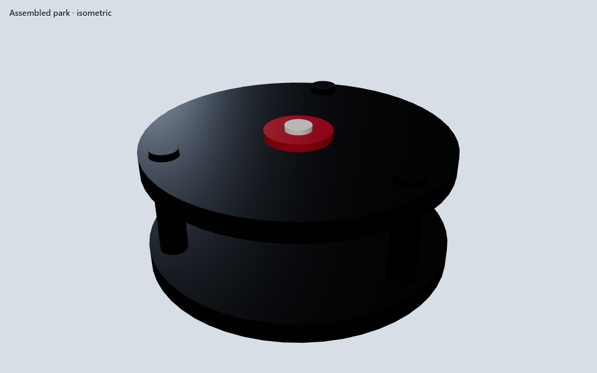
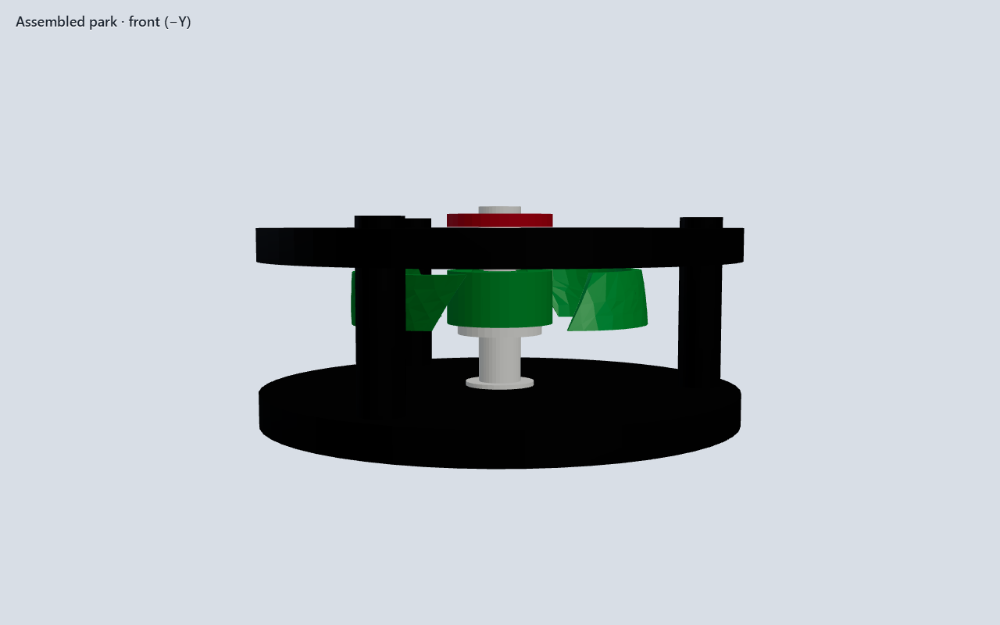
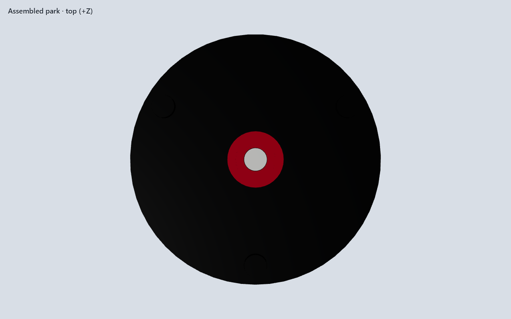

# Print-kit tutor — GD&T and printability study

Pro-forma study for benchmark #1 (`fdm-print-spinner`). The first assembled
spinner looked like a kit and was not one. This page is the correction
record. Numbers live in `scripts/fixtures/print-kit-tutor.spec.json`.

## Faults found (and closed)

| Fault | Why it failed | Correction |
|-------|---------------|------------|
| Rotor vs posts | C-buckets sweep ~Ø56. Posts on R24 × Ø6 occupy R21–27. They collide. | Posts on **R38 × Ø8**. Inner wall R34. Sweep stays ~R28. ≥6 mm air. |
| Posts vs plate | Posts stopped at the plate bottom. Holes did not locate. | Posts continue **through** the 6 mm plate and stand **2 mm proud**. |
| Bushing seat | Plate and seat were both 4 mm. Seat was a through-hole. Bushing falls. | Plate **6 mm**. Seat **4 mm** from the top. **2 mm land** under the sleeve. |
| Cone “seat” | Same 45° + tip lift = parallel cones. No contact. Shaft falls. | Female 45° r5. Male r**4.8** (0.20 radial). Thrust on a **Ø13 × 0.8 land** with **0.20 float**. |
| Rotor drive | Round-on-round slip. Rotor need not turn the shaft. | **Double-D** 6.0 / 6.4 in the hub zone only. Upper journal stays round for the sleeve. |
| Skinny posts | Ø6 × 28 mm (aspect 4.7) will wobble on FDM. | **Ø8 × 32 mm** through the plate. |
| Cap grind | Cap sat on the plate with 0 gap. | **0.20 mm cap float** above the plate. |
| Frame size | Ø64 plate could not hold a cleared post circle. | **Ø90** base and plate. |
| Hub vs shoulder | Hub started at the shoulder plane with an Ø8.4 bore around the Ø16 shoulder. They occupy the same volume. | Hub **sits on the shoulder top**. `plate_z` includes the 2 mm shoulder. |
| Twisted buckets | Radial C-walls at 10°/20° ortho-snapped (`ctrl_held: false`). Loft stations had no closed profile. | Draw bucket walls with **ctrl held** so the helical stations stay closed. |

## Datum scheme

| Datum | Feature | Role |
|-------|---------|------|
| **A** | Base bottom | Primary. Frame print bed. |
| **B** | Journal / cone axis | Secondary. Spinner axis. |
| **C** | 3× Ø8 posts, Ø76 PCD, 120° | Tertiary. Top-plate location. |

Position of C to B: **Ø0.4 MMC** (one 0.4 mm nozzle). Tighter than that is a
gauge-print problem, not a CAD problem.

## Fits (modeled in CAD, slicer XY hole comp = 0)

| Joint | Class | CAD |
|-------|-------|-----|
| Journal ↔ bushing | Running | Ø8.0 / Ø8.4 (+0.40 diametral) |
| Posts ↔ plate | Location slip | Ø8.0 / Ø8.4, through |
| Bushing ↔ seat | Location slip | Ø14.0 / Ø14.4 + 2 mm land |
| Double-D drive | Location slip | 6.0 / 6.4 across flats |
| Cone center | Clearance | 0.20 radial at the mouth |
| Thrust land, cap | Axial play | 0.20 float — **no coincident running faces** |

Shoulder ↔ hub bottom is a **sitting** face (they rotate together). That
contact is intentional.

## Printability (0.4 mm Bambu, 0.20 mm layer)

| Body | Print orientation | Notes |
|------|-------------------|-------|
| Base | As assembled (A on the bed) | 45° cup needs no support. Posts print up; elephant foot is at the root, not in the plate holes. |
| Shaft | Land / shoulder on the bed | Do not print on the cone tip. Double-D flats are vertical walls. |
| Rotor | Hub face on the bed | 1.8 mm walls ≈ 4–5 perimeters. 20° twist, 3 stations. |
| Top plate | Flat | All functional holes are complete XY circles. |
| Bushing | Ring on the bed | Bore is an XY circle. |
| Cap | Flat | Same. |

Minimum wall 1.6 mm. No horizontal holes. No FDM press fits. Break 0.4×45
on post tips in the slicer if they hang on the plate.

## Assembly (proper)

1. Shaft cone into the cup — land floats 0.20 above A.
2. Rotor double-D onto the journal; hub **sits on** the shoulder (they rotate together).
3. Top plate down the three posts (holes actually engage).
4. Sleeve into the shouldered seat.
5. Cap onto the round journal, 0.20 above the plate.

If those five steps are not visible in the solid, the exam failed.

## Assembled park

## As-built stack (Node exam, 2026-08-15)

| Body | z min–max | Notes |
|------|-----------|--------|
| Base + posts | 0–38 | Posts through the 30–36 plate, 2 mm proud |
| Shaft | 1.5–40 | Land above the cup; journal through the cap |
| Rotor | 18–28 | Sits on the shoulder; 2 mm air to the plate |
| Top plate | 30–36 | Ø90 × 6 |
| Bushing | 32–36 | On the 2 mm land |
| Cap | 36.2–38.6 | 0.20 float |

Rotor sweep R28 < post inner R34. Six coaxial bodies. READY TO PRINT.
